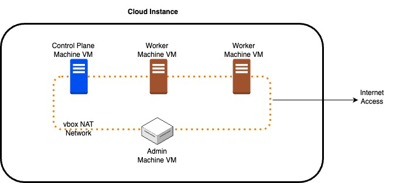
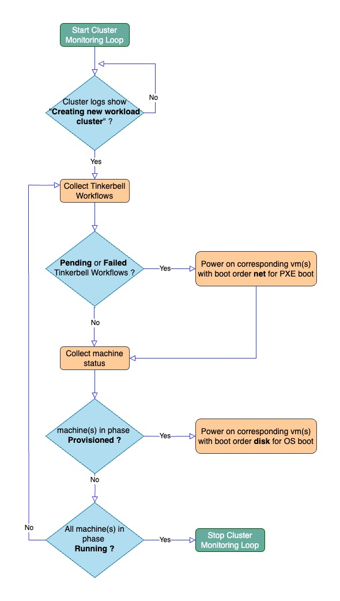

# b.r.a.v.e
`Bare Metal Replication And Virtualization Environment`

---

- [Overview](#overview)
- [Installation](#installation)
- [Usage](#usage)
- [Supported Infrastructure Providers and Provisioners]
- [Supported Use Cases](#supported-use-cases)
     - [Deploying VMs on a Cloud Instance]
     - [EKSA Bare Metal Kubernetes Cluster Creation]
         - [How `b.r.a.v.e` creates EKSA-BM Cluster](#how-brave-works)
         - [Power Management Algorithm For EKSA-BM](#power-management-algorithm)
         - [Accessing EKSA-BM Cluster](#accessing-cluster)
         - [Advanced Usage, Debugging and VM Management](#vm-management-debugging-and-advanced-usage)         

---
## Overview

`b.r.a.v.e` (Bare Metal Replication And Virtualization Environment) offers a **virtual**, **cost-efficient**, **convenient**, **automated** and **on-demand** option for executing use cases requiring bare metal infrastructure.  

Cost and complexity of bare metal deployments can be prohibitive for a number of non production use cases such as : 
  - creating **on-demand labs** for conducting quick proof of concepts, demos or experiments 
  - creating **testbed environments** for development, debugging and automated testing 

`b.r.a.v.e` simplifies and streamlines bare metal deployments (especially for non production use cases) by: 

- Providing fully automated instantiation of a singular cloud-based instance on one of the supported cloud providers (currently [Oracle Cloud Infrastructure](https://www.oracle.com/au/cloud/) and [Amazon Web Services](https://aws.amazon.com/) are supported) 

- Replicating the entire bare metal infrastructure within this singular cloud instance by employing [Virtualbox](https://www.virtualbox.org/) and [vagrant](https://www.vagrantup.com/) managed virtual machines and capitalizing on Virtualbox's network capabilities.

- Providing multiple provisioners that execute tailored workflows specifically designed for utilizing bare metal infrastructure in various use cases.

`b.r.a.v.e` facilitates a spectrum of automated workflows through its provisioners:

1. **VM Deployment**: Enables deployment of mutiple virtual machines with configurable capacity and OS flavours on a single layer 2 network. These virtual machines are allocated static IPs and have outbound access to the Internet. This setup serves as a versatile deployment solution for interconnected bare metal servers. `b.r.a.v.e` also configures SSH access to these VMs from the hosting cloud instance. This capability is supported by the `vms_only` provisioner.

2. **EKS Anywhere Bare Metal Cluster Creation**: Facilitates the creation of an EKS Anywhere Bare Metal (EKSA-BM) Kubernetes cluster.  Virtualbox-managed VMs emulate an EKSA admin machine along with all cluster machines. Interconnectivity among these EKSA machines is achieved through a Virtualbox NAT network, allowing cluster machines to PXE boot from the admin machine and install software from the Internet.  `b.r.a.v.e` also implements a power management algorithm that monitors the state of the cluster and perform automatic power on and off of the Virtualbox VMs without requiring BMC integration. This power management is mandatory for automated provisioning of an EKSA cluster. This functionality is supported by `eksabm_cluster` provisioner.  This provisioner uses **eksctl anywhere** cli for EKSA operations. 

3. **EKS Anywhere Bare Metal Cluster Creation using Rafay Controller**: This functionality is supported by `rafay_eksabm_cluster` provisioner.  This provisioner uses [Rafay Systems Inc.](https://docs.rafay.co/clusters/eksa_bm/overview/) Controller for EKSA operations. All other implementation details are same as `eksabm_cluster` provisioner explained above. 

`b.r.a.v.e` is written to be extensible and its functionality can be extended for new bare metal use cases by adding new provisioners. Each provisioner implements tailored workflow specifically designed for utilizing bare metal infrastructure in a particular use cases.

---

## Installation

### Clone Repo locally

```sh
git clone https://github.com/RafaySystems/brave.git
```
OR 

```sh
git clone git@github.com:RafaySystems/brave.git
```

### Install Terraform

Follow [instructions to install Terraform](https://developer.hashicorp.com/terraform/tutorials/aws-get-started/install-cli)


### Install Python3 and dependencies 

Ensure Python 3.x is installed on your system. 

In order to avoid modifying your system state, we recommend the use of a virtual environment. Python 3's distribution comes with `venv` preinstalled:

```sh
python3 -m venv venv
source venv/bin/activate
cd brave
pip3 install -r requirements.txt
```

---
##  Usage 

1. A file named `input.yaml` is expected to provide configuration input for `b.r.a.v.e`. This file describes the desired deployment to create. Populate this `input.yaml` file using the provided sample file and then edit it to customize it. 

```sh
cp -p sample-input.yaml input.yaml
```

Now edit `input.yaml` as per your setup. 

**Note**: Please select an appropriate `infrastructure_provider` and `provisioner`. You only need to populate `infrastructure_provider_config` and `provisioner_config` for the selected `infrastructure_provider` and `provisioner` respectively. Refer to [discussion on structure of `input.yaml`](docs/input-yaml.md)  for detailed description of the file structure and help on creating an `input.yaml` file. 


2. Source python env 

```sh
source venv/bin/activate
```

3. Launch **`b.r.a.v.e`** . Below will create the deployment defined in `input.yaml` file using specified `infrastructure_provider` and `provisioner`. Sample execution outputs are availaible in **docs/sample-run-output/** directory for reference. 


```sh
./launch.py
```

**COMMENT**:: If you wish to follow along and look under the hood while `b.r.a.v.e` is doing its job, refer to [VM management, debugging and advanced usage section](#vm-management-debugging-and-advanced-usage)


4. Deleting existing setup as specified in input.yaml (also tears down the cloud instance depending on infrastructure provider selected)

```sh
./delete.py
```

---

## Supported Infrastructure Providers and Provisioners

`b.r.a.v.e` supports virtualization of a number of bare metal deployment use cases. To support these, a number of `infrastructure_provider` and  `provisioner` options are exposed which can be used in any combination to fit a particular bare metal deployment use case.  


Three **`infrastructure_provider`** options are currently supported: 

  1. `aws`: Cloud instance is automatically launched in AWS Public Cloud. Instance types of `metal` are required. 

  2. `oci`: Cloud instance is automatically launched in OCI Public Cloud. All instance types are compatible. 

  3. `infra_exists`: No cloud instance is automatically launched. A pre-existing instance is assumed. SSH access is required to this instance. 


Supported **`provisioner`** options are :

  1. `vms_only`: Supports automatic deployment of virtual machines on the cloud instance. Virtualbox-managed VMs are allocated static IPs on the same layer2 network and have outbound access to the Internet. 
    
  2. `eksabm_cluster`: Supports automatic creation of an EKSA-BM cluster using VMs on the cloud instance. Leverages `eksctl anwhere` cli for cluster creation and Virtualbox for networking, VM management/power management.

  3. `rafay_eksabm_cluster`:  Uses [Rafay System's](https://rafay.co/) controller for EKSA-BM cluster creation and Virtualbox for networking, VM management/power management.
    
  4. `none`:  No provisioner option. If specified, no provisioner is applied (no VMs etc. created). Possible use case is just creation of the cloud instance. 


**Note**: Refer to [discussion on structure of `input.yaml`](docs/input-yaml.md)  for further details. 


---

##  Supported Use Cases 

`b.r.a.v.e` facilitates a spectrum of automated workflows through its provisioners. Below is a discussion of these provisioners and the use cases they support in detail.


### Deploying VMs on a Cloud Instance  

Most conventional bare metal deployments encompass a small network of interconnected servers capable of direct communication among themselves and with external networks through a designated gateway. However, setting up non-production replicas of such deployments for testing, evaluations, demonstrations, or development purposes can become cost-prohibitive, primarily due to hardware specifications.

`b.r.a.v.e` offers a solution to virtualize these deployments, substantially reducing costs and hardware requirements. This is achieved by employing Virtualbox and vagrant managed VMs to replicate bare metal servers and utilizing Virtualbox networking capabilities to establish the necessary networking infrastructure within a single cloud instance, available on supported public clouds. All essential software and packages are automatically installed on this cloud instance.


As an example, below excerpt of `input.yaml` instructs `b.r.a.v.e` to 
- Provision a cloud instance in OCI public cloud (`infrastructure_provider` is set as `oci`)
- Deploy total 3 Virtualbox VMs on this instance (`provisioner` is set as `vms_only`):
     - 2x ubuntu 20.04 VMs with name *workers* and capacity cpu=3vcpus and memory=16GB. These VMs will be named `workers-1` and `workers-2`
     - 1x ubuntu 20.04 VM with name *storage* and capacity cpu=2vcpus and memory=16GB. This VM will be named `storage-1`. 

```sh
infrastructure_provider: oci  
infrastructure_provider_config:
  oci:
    host_name: "brave-node"
    .....
    .....

provisioner: vms_only 
provisioner_config:
# VM Provisioner configuration
  vms_only:
    - name: "workers"
      count: 2
      cpu: 3       # in vcpus 
      mem: 16384   # in MB 
      osfamily: ubuntu # currently only ubuntu is supported
      vagrant_box: "bento/ubuntu-20.04"
    - name: "storage"
      #count: 1             # (default value)
      #cpu: 2               # (default value)
      #mem: 16384           # (default value)
      #osfamily: ubuntu     # (default value)
      #vagrant_box: "bento/ubuntu-20.04"  # (default value)
```

####  Accessing VMs and Debugging

Virtualbox VMs are allocated static IPs just like bare metal servers would and ssh connectivity is automatically programmed so that all VMs can be logged into from the cloud instance. For instance, to access VMs created in example [above](#deploying-vms-on-a-cloud-instance) :

1. SSH to the cloud instance. An entry should already have been created in your ~/.ssh/config. Example entry:
```sh
Host brave-node
  Hostname 129.153.193.176
  StrictHostKeyChecking no
  IdentityFile /opt/rafay/keys/oci
  User ubuntu
```
To ssh simply use something like `ssh brave-node`

2. From the cloud instance, ssh to the VM by name. You can check the contents of `/home/ubuntu/.ssh/config` for name of VMs

```sh
cat /home/ubuntu/.ssh/config
ssh workers-1
```


###  EKSA Bare Metal Kubernetes Cluster Creation using VMs 

EKS Anywhere Bare Metal (EKSA-BM) Kubernetes cluster creation can be non trivial and cost prohibitive for certain non production use cases as there are extensive [hardware and networking requirements](docs/eksabm-pre-reqs.md) to meet.  

`b.r.a.v.e`  makes it possible to create non production EKSA-BM clusters without having access to specialized hardware or networking setup. With `b.r.a.v.e` , extensive [hardware and networking requirements](docs/eksabm-pre-reqs.md) of an EKSA-BM cluster are reduced to just a **single** requirement :

- Having permission to launch a **single cloud instance** in a supported cloud provider (AWS and OCI are currently supported). 

`b.r.a.v.e` can:
1. Launch an instance in a cloud provider.
2. Inside this cloud instance, create all infrastructure required for supporting an EKSA-BM cluster. This includes vms to emulate the machines and the network.  
3. Using this virtual infrastructure, create an EKSA-BM cluster **without any power management support** (fully automated end to end). 

Since entire infrastructure is contained within a single cloud instance, the entire infrastructure can be shut down by just stopping the cloud instance. This is not only convenient (no hardware required) but also cost effective.  Simply start the instance back up when you wish to restart the cluster.  


#### How `b.r.a.v.e` creates EKSA Bare Metal Kubernetes Cluster 



`b.r.a.v.e` simplifies EKSA-BM cluster creation by emulating the entire networking and bare metal setup required for creating EKSA-BM clusters on a **single cloud instance** of a cloud provider. `b.r.a.v.e` achieves this by:

1. `Creating a cloud instance` on a supported cloud or infrastructure provider. [Terraform](https://www.terraform.io/) is used to power this functionality. (A pre-existing compute instance can also be used). Currently supported infrastructure providers are [Oracle Cloud Infrastructure (OCI)](https://www.oracle.com/au/cloud/) and [Amazon Web Services](https://aws.amazon.com/).    

2. Leveraging [Virtualbox](https://www.virtualbox.org/) and [vagrant](https://www.vagrantup.com/) to `create EKSA-BM cluster setup on the cloud instance using vms and a` [NAT Network](https://www.virtualbox.org/manual/ch06.html#network_nat_service). Virtualbox vms are used to emulate cluster hardware and the Admin machine, whereas VirtualBox's NAT Network is used to emulate the Layer2 Network these machines are connected to. This way EKSA-BM machines are connected to each other on a Layer2 network and also able to reach the Internet.  


3. Providing an `automation engine to handle cluster lifecycle management operations` for EKSA-BM clusters end to end without any manual intervention. EKSA-BM cluster's lifecycle can be managed by a number of supported provisioners. Currently three types of provisioners are supported:
    -   `rafay` (using [Rafay Systems Inc.](https://docs.rafay.co/clusters/eksa_bm/overview/) Controller)
    -   `native` (using **eksctl anywhere** cli directly)  
    -   `none`  (no cluster creation is performed)

4. Automatically handling `power management of cluster machines WITHOUT a BMC controller by watching relevant cluster events` and performing power on and off of vms via VBoxManage cli. (See [below](#power-management-algorithm))

**Note**: End to end creation of cluster (including time to create cloud instance) can be range anywhere between 30 to 50 minutes. Please be patient. 

```sh
infrastructure_provider: oci  
infrastructure_provider_config:
  oci:
    host_name: "brave-node"
    ....
    ....

provisioner: eksabm_cluster 
provisioner_config:
  eksabm_cluster:
    cluster_name: "brave"
    operation_type: "provision"
    k8s_version: "1.27"
    num_control_plane_nodes: 1
    num_worker_nodes: 1    
```

Also possile 

```sh
provisioner: eksabm_cluster 
provisioner_config:
  eksabm_cluster:
    cluster_name: "brave-cluster"
    operation_type: "provision"
    config_file_name: "eksa-bm-config.yaml"    
```

Refer to [VM Management, Debugging and Advanced Usage](docs/vm-mgmt.md) doc for more details. 


### Power Management Algorithm For EKSA-BM 

Since Virtualbox does not support Baseboard Management Controller (BMC) integration,  automatically powering machines on and off is not possible. Without BMC support, machines have to be powered on and off manually at the correct time during provisioning, upgrading and scaling. 

To address this issue, `b.r.a.v.e` implements a power management algorithm that monitors the state of the cluster and perform automatic power management of the Virtualbox vms without requiring BMC integration. Powering on and off of vms is carried our using [VBoxManage](https://www.virtualbox.org/manual/ch08.html) tool. This algorithm is described below: 





1. Start a loop to monitor cluster progress.

2. Check if the cluster creation logs indicate cluster has reached state where machines need to be powered on. This is indicated by presence of string **"Creating new workload cluster"** in the logs.

3. Collect Tinkerbell workflows and their status: Pending, Running, Failed, and Success.

4. If there are **Pending or Failed** Tinkerbell workflows, power cycle the respective Virtualbox vms with net boot order to initiate a PXE boot of the machine and start these workflows. Use MAC address to correlate which Tinkerbell workflows correspond to which Virtualbox vms. 

5. Collect machine status from the cluster. Check if any machine is in the **Provisioned** phase. If found, power cycle it with boot order set as disk so that it boots from installed OS on the disk by Tinkerbell workflow and enters **Running** phase.

6. Repeat the loop until all machines are in the **Running** phase, signifying the completion of cluster creation.


###  Accessing EKSA-BM Cluster

Once Cluster has been successfully created, you can access it using following steps:
1. SSH to the cloud instance. An entry should already have been created in your ~/.ssh/config. Example entry:
```sh
Host brave-node
  Hostname 129.153.193.176
  StrictHostKeyChecking no
  IdentityFile /opt/rafay/keys/oci
  User ubuntu
```
To ssh simply use something like `ssh brave-node`

2. From the cloud instance, ssh to eksa-admin machine
```sh
ssh eksa-admin-1
```

3. Once on `eksa-admin` machine, access cluster using its kubeconfig:

   - If using `native` provisioner, you can find cluster kubeconfig under `/opt/rafay/native/` on eksa-admin machine. For example `/opt/rafay/native/brave/brave/brave-eks-a-cluster.kubeconfig`.  
   
   The directory `/opt/rafay/native/` contains all cluster files generated by eksctl for the cluster such as hardware.csv, cluster config etc. You will need to switch to root user to access this directory using `sudo su -` on `eksa-admin` machine. 

   - If using `rafay` provisioner, you can find cluster kubeconfig under `/opt/rafay/eksabm/` on eksa-admin machine. For example `/opt/rafay/eksabm/brave/brave/brave-eks-a-cluster.kubeconfig`. 
   
   The directory `/opt/rafay/eksabm/` contains all cluster files generated by eksctl for the cluster such as hardware.csv, cluster config etc. You will need to switch to root user to access this directory using `sudo su -` on `eksa-admin` machine.  

 ```sh
sudo su - 
KUBECONFIG=/opt/rafay/native/brave/brave/brave-eks-a-cluster.kubeconfig kubectl get pods -A
```  


4. To ssh into cluster nodes for debugging, on `eksa-admin` machine ssh into the IP of node vm. The IP address can be derived from `kubectl get nodes -o wide` or from the hardware.csv file under directory `/opt/rafay/native` or `/opt/rafay/eksabm` on `eksa-admin` machine   

```sh
sudo su - 
KUBECONFIG=/opt/rafay/native/brave/brave/brave-eks-a-cluster.kubeconfig kubectl get nodes -o wide

ssh -i /home/vagrant/ssh_private_key_file ec2-user@ip-of-node-vm
```


###  Advanced Usage, Debugging and VM Management

During cluster creation or for debugging and/or advanced use cases, it is possible to take a look [under the hood](docs/vm-mgmt.md). Some of supported advanced actions are : 

- List all virtual resources created and their status. EKSA-BM specific details such as hardware.csv for clusters are also available   
- Launch additional vms. This could perhaps be used for manual scaling or upgrades scenarios
- Delete vms 
- Watch consoles of the vms for debugging via virtualbox GUI 
- Connecting to vms over ssh 
- Resurrecting vms on a reboot or restart of the cloud instance
- Manually power vms on/off and change boot order 

Refer to this [VM Management, Debugging and Advanced Usage](docs/vm-mgmt.md) doc for more details. 

---

