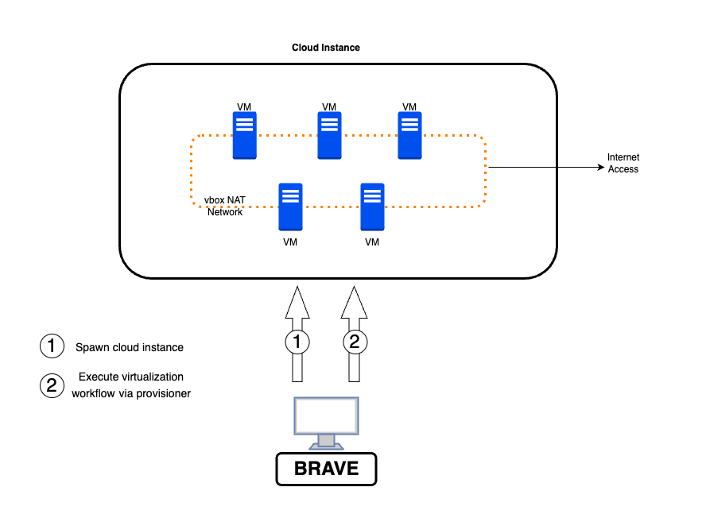
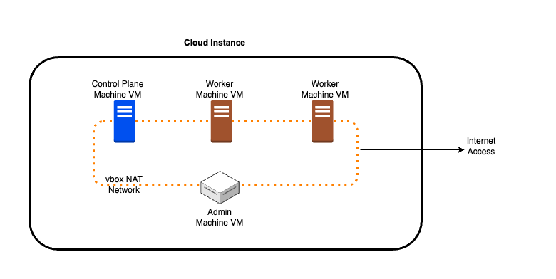
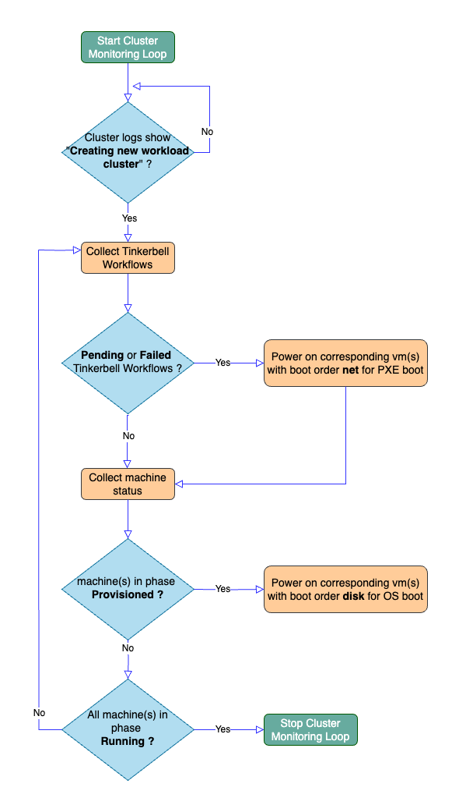

# BRAVE
`Bare Metal Replication And Virtualization Environment`

---

- [Overview](#overview)
- [Applications](#applications)
- [Installation](#installation)
    - [Clone Repo locally](#clone-repo-locally)
    - [Install Terraform](#install-terraform)
    - [Install Python3 and dependencies](#install-python3-and-dependencies)
- [Usage](#usage)
    - [Usage Videos](#usage-videos)
    - [Structure of Configuration File](#structure-of-configuration-file)
    - [Multiple BRAVE Environments](#multiple-brave-environments)
- [Supported Infrastructure Providers and Provisioners](#supported-infrastructure-providers-and-provisioners)
- [Supported Use Cases](#supported-use-cases)
     - [Deploying VMs on a Cloud Instance](#deploying-vms-on-a-cloud-instance)
         - [Accessing VMs and Debugging](#accessing-vms-and-debugging)
     - [EKSA Bare Metal Kubernetes Cluster Creation using VMs](#eksa-bare-metal-kubernetes-cluster-creation-using-vms)
         - [How BRAVE creates EKSA Bare Metal Kubernetes Cluster](#how-brave-creates-eksa-bare-metal-kubernetes-cluster)
         - [Power Management Algorithm For EKSA-BM](#power-management-algorithm-for-eksa-bm)
         - [Accessing EKSA-BM Cluster](#accessing-eksa-bm-cluster)
         - [Advanced Usage, Debugging and VM Management](#advanced-usage-debugging-and-vm-management)         
- [Summary](#summary)

---
## Overview

**BRAVE** (Bare Metal Replication And Virtualization Environment) offers a **virtual**, **cost-efficient**, **convenient**, **automated** and **on-demand** tool for executing use cases requiring bare metal infrastructure.  

Cost and complexity of bare metal deployments can be prohibitive for a number of non production use cases such as : 
  - Creating **on-demand labs** for conducting quick proof of concepts, demonstrations or experiments 
  - Creating **testbed environments** for development, debugging and automated testing 
  - Performing comprehensive architectural and security assessments through construction of proof of concept deployments.

**BRAVE** simplifies and streamlines bare metal deployments (especially for non production use cases) by: 

- Providing fully automated instantiation of a singular cloud-based instance on one of the supported cloud providers (currently [Oracle Cloud Infrastructure](https://www.oracle.com/au/cloud/) and [Amazon Web Services](https://aws.amazon.com/) are supported) 

- Replicating the entire bare metal infrastructure within this singular cloud instance by employing [Virtualbox](https://www.virtualbox.org/) and [vagrant](https://www.vagrantup.com/) managed virtual machines and capitalizing on Virtualbox's network capabilities.

- Providing multiple provisioners that execute tailored workflows specifically designed for utilizing bare metal infrastructure in various use cases.

**BRAVE** facilitates a spectrum of automated workflows through its provisioners:

1. **VM Deployment**: Enables deployment of mutiple virtual machines with configurable capacity and OS flavours on a single layer 2 network. These virtual machines are allocated static IPs and have outbound access to the Internet. This setup serves as a versatile deployment solution for interconnected bare metal servers. **BRAVE** also configures SSH access to these VMs from the hosting cloud instance. This capability is supported by the `vms_only` provisioner.

2. **EKS Anywhere Bare Metal Cluster Creation**: Facilitates the creation of an EKS Anywhere Bare Metal (EKSA-BM) Kubernetes cluster.  Virtualbox-managed VMs emulate an EKSA admin machine along with all cluster machines. Interconnectivity among these EKSA machines is achieved through a Virtualbox NAT network, allowing cluster machines to PXE boot from the admin machine and install software from the Internet.  **BRAVE** also implements a power management algorithm that monitors the state of the cluster and perform automatic power on and off of the Virtualbox VMs without requiring BMC integration. This power management is mandatory for automated provisioning of an EKSA cluster. This functionality is supported by `eksabm_cluster` provisioner.  This provisioner uses **eksctl anywhere** cli for EKSA operations. 

3. **EKS Anywhere Bare Metal Cluster Creation using Rafay Controller**: This functionality is supported by `rafay_eksabm_cluster` provisioner.  This provisioner uses [Rafay Systems Inc.](https://docs.rafay.co/clusters/eksa_bm/overview/) Controller for EKSA operations. All other implementation details are same as `eksabm_cluster` provisioner explained above. 



**BRAVE** is written to be extensible and its functionality can be extended for new bare metal use cases by adding new provisioners. Each provisioner implements tailored workflow specifically designed for utilizing bare metal infrastructure in a particular use case.

**BRAVE** is a [Rafay Systems Inc.](https://rafay.co/) project. For a comprehensive list of all open-source projects by Rafay, please refer to this [link](https://docs.rafay.co/oss/overview/).

---

## Applications 

- **Development and Testing Environments**: Developers can use the tool to create virtualized instances of bare metal servers for testing applications, new software configurations, or updates without affecting production environments.

- **Automated Testing Pipelines**: Integration into automated testing pipelines allows for the creation of disposable VM instances on bare metal servers, facilitating continuous integration and deployment (CI/CD) workflows.

- **Security Testing and Vulnerability Assessment**: Security professionals can use the tool to  simulate different attack scenarios, test security measures, and perform vulnerability assessments in a controlled environment without risking actual production systems.

- **DevOps Testing Environment Creation**: Developers and operations teams often require testing environments that mimic production setups. This tool can create VMs on bare metal to replicate various configurations, allowing for robust testing of software deployments, updates, and configurations.

- **Disaster Recovery Testing**: Simulate disaster recovery scenarios by virtualizing bare metal servers and testing backup and recovery processes.Ensure the resilience and reliability of applications in case of hardware failures or other catastrophic events.

- **Scaling Infrastructure Testing**: Organizations planning to scale their infrastructure can use the tool to simulate the impact of increased loads, ensuring that their systems can handle the growth effectively before implementing changes in the actual environment.

- **Research and Development**: Researchers or innovators can leverage the virtualized bare metal servers to experiment with new technologies, run simulations, or conduct performance evaluations without the need for dedicated physical hardware.

- **Education and Training**: It can serve as an educational tool for students or professionals learning about server infrastructure. They can practice setting up, configuring, and managing servers in a safe and controlled virtual environment.

- **Cost Reduction**: Creating virtual environments for all above use cases at fraction of cost of physical hardware.  Elimination of the need for dedicated physical hardware, also reduces associated costs like procurement, maintenance, and space.

---

## Installation

### Clone Repo locally

```sh
git clone https://github.com/RafaySystems/brave.git
```
OR 

```sh
git clone git@github.com:RafaySystems/brave.git
```

### Install Terraform

Follow [instructions to install Terraform](https://developer.hashicorp.com/terraform/tutorials/aws-get-started/install-cli)


### Install Python3 and dependencies 

Ensure Python 3.x is installed on your system. 

In order to avoid modifying your system state, we recommend the use of a virtual environment. Python 3's distribution comes with `venv` preinstalled:

```sh
python3 -m venv venv
source venv/bin/activate
cd brave
pip3 install -r requirements.txt
```

---
##  Usage 

1. A file named `input.yaml` is expected to provide configuration input for **BRAVE**. This file describes the desired deployment to create. Populate this `input.yaml` file using the provided [sample configuration file](sample-input.yaml) and then edit it to customize it. 

A number of ready to use examples are also provided in [discussion on the structure](docs/input-yaml.md) of BRAVE's configuration file.

```sh
cp -p sample-input.yaml input.yaml
```

Now edit `input.yaml` as per your setup. 

**Note**: Please select an appropriate `infrastructure_provider` and `provisioner`. You only need to populate `infrastructure_provider_config` and `provisioner_config` for the selected `infrastructure_provider` and `provisioner` respectively. Refer to [discussion on structure](docs/input-yaml.md) of `input.yaml` for detailed description of the file structure and help on creating an `input.yaml` file. 


2. Source python env 

```sh
source venv/bin/activate
```

3. Launch **BRAVE** . Below will create the deployment defined in `input.yaml` file using specified `infrastructure_provider` and `provisioner`. Sample execution outputs are availaible in **docs/sample-run-output/** directory for reference. 


```sh
./brave.py
```

**Note**:: If you wish to follow along and look under the hood while **BRAVE** is doing its job, refer to [Advanced Usage, Debugging and VM Management](#advanced-usage-debugging-and-vm-management)


4. Deleting existing setup as specified in input.yaml (also tears down the cloud instance depending on infrastructure provider selected)

```sh
./delete.py
```

---

### Usage Videos 

- Using BRAVE to create VMs simulating Bare Metal servers using an OCI cloud instance

[](http://www.youtube.com/watch?v=BK-KHmxRZB0 "Using BRAVE to create VMs simulating Bare Metal servers using an OCI cloud instance")

- Using BRAVE to create an EKSA Bare Metal cluster using an OCI cloud instance

[](http://www.youtube.com/watch?v=hbYLJfoaC4Y "Using BRAVE to create an EKSA Bare Metal cluster using an OCI cloud instance")

- Using BRAVE to create an RAFAY EKSA Bare Metal cluster using an OCI cloud instance

[](http://www.youtube.com/watch?v=GCAL9J7bRzA "Using BRAVE to create an RAFAY EKSA Bare Metal cluster using an OCI cloud instance")

---

### Structure of Configuration File 

File named `input.yaml` contains all configuration input for **BRAVE**.  This file describes the desired deployments to create. Refer to [discussion on structure](docs/input-yaml.md)  of `input.yaml` for detailed description of the file's contents. 


### Multiple BRAVE Environments  

The file directory housing a BRAVE environment defines its enclosure. To run multiple environments simultaneously, utilize a separate directory for each environment.

---

## Supported Infrastructure Providers and Provisioners

**BRAVE** supports virtualization of a number of bare metal deployment use cases by automatically creating a cloud instance and then executing workflows to spawn virtualized bare metal infrastructure within the cloud instance. Configuration item `infrastructure_provider` determines the public cloud to use and `provisioner` selects workflow to execute. A number of `infrastructure_provider` and `provisioner` settings are exposed which can be used in any combination to fit a particular bare metal deployment use case.

The `infrastructure_provider` determines which public cloud is used to deploy the cloud instance to house the virtualized bare metal infrastructure. The options currently supported are:

  1. `aws`: Cloud instance is automatically launched in AWS Public Cloud. Instance types of `metal` are required. 

  2. `oci`: Cloud instance is automatically launched in OCI Public Cloud. All instance types are compatible. 

  3. `infra_exists`: No cloud instance is automatically launched. A pre-existing instance is assumed. SSH access is required to this instance. 


The `provisioner` setting determines workflow that would be run on the cloud instance. Each workflow is targeted to a specific use case for instance creating VMs, creating a cluster etc. Currently supported settings for `provisioner` are :

  1. `vms_only`: Supports automatic deployment of virtual machines on the cloud instance. Virtualbox-managed VMs are allocated static IPs on the same layer2 network and have outbound access to the Internet. 
    
  2. `eksabm_cluster`: Supports automatic creation of an EKSA-BM cluster using VMs on the cloud instance. Leverages `eksctl anwhere` cli for cluster creation and Virtualbox for networking, VM management/power management.

  3. `rafay_eksabm_cluster`:  Uses [Rafay System's](https://rafay.co/) controller for EKSA-BM cluster creation and Virtualbox for networking, VM management/power management.
    
  4. `none`:  No provisioner option. If specified, no provisioner is applied (no VMs etc. created). Possible use case is just creation of the cloud instance. 


**Note**: Refer to [discussion on structure](docs/input-yaml.md) of `input.yaml` for further details. 


---

##  Supported Use Cases 

**BRAVE** facilitates a spectrum of automated workflows through its provisioners. Below is a discussion of these provisioners and the use cases they support in detail.


### Deploying VMs on a Cloud Instance  

Most conventional bare metal deployments encompass a small network of interconnected servers capable of direct communication among themselves and with external networks through a designated gateway. However, setting up non-production replicas of such deployments for testing, evaluations, demonstrations, or development purposes can become cost-prohibitive, primarily due to hardware specifications.

**BRAVE** offers a solution to virtualize these deployments, substantially reducing costs and hardware requirements. This is achieved by employing Virtualbox and vagrant managed VMs to replicate bare metal servers and utilizing Virtualbox networking capabilities to establish the necessary networking infrastructure within a single cloud instance, available on supported public clouds. All essential software and packages are automatically installed on this cloud instance.


As an example, below excerpt of `input.yaml` instructs **BRAVE** to 
- Provision a cloud instance named "brave-node" in OCI public cloud (`infrastructure_provider` is set as `oci`)
- Deploy total 3 Virtualbox VMs on this instance (`provisioner` is set as `vms_only`):
     - 2x ubuntu 20.04 VMs with name *workers* and capacity cpu=3vcpus and memory=16GB. These VMs will be named `workers-1` and `workers-2`
     - 1x ubuntu 20.04 VM with name *storage* and capacity cpu=2vcpus and memory=16GB. This VM will be named `storage-1`. 

```sh
infrastructure_provider: oci  
infrastructure_provider_config:
  oci:
    host_name: "brave-node"
    .....
    .....

provisioner: vms_only 
provisioner_config:
# VM Provisioner configuration
  vms_only:
    - name: "workers"
      count: 2
      cpu: 3       # in vcpus 
      mem: 16384   # in MB 
      osfamily: ubuntu # currently only ubuntu is supported
      vagrant_box: "bento/ubuntu-20.04"
    - name: "storage"
      #count: 1             # (default value)
      #cpu: 2               # (default value)
      #mem: 16384           # (default value)
      #osfamily: ubuntu     # (default value)
      #vagrant_box: "bento/ubuntu-20.04"  # (default value)
```

####  Accessing VMs and Debugging

Virtualbox VMs are allocated static IPs just like bare metal servers would and ssh connectivity is automatically programmed so that all VMs can be logged into from the cloud instance. For instance, to access VMs created in example [above](#deploying-vms-on-a-cloud-instance) :

1. SSH to the cloud instance. An entry should already have been created in your ~/.ssh/config. To ssh, simply use something like `ssh brave-node`

2. From the cloud instance, ssh to the VM by name. You can check the contents of `/home/ubuntu/.ssh/config` for name of VMs

```sh
cat /home/ubuntu/.ssh/config
ssh workers-1
```

From the cloud-instance, it is possible to perform a number of debug actions. Some of supported advanced actions are : 

- Connecting to VMs over ssh 
- List all virtual resources created and their status.
- Launch VMs
- Delete VMs 
- Watch consoles of the VMs for debugging via virtualbox GUI 
- Resurrecting VMs on a reboot or restart of the cloud instance
- Manually power VMs on/off and change boot order 

Refer to this [Debugging and VM Management](docs/vm-mgmt-debug.md) doc for more details. 

###  EKSA Bare Metal Kubernetes Cluster Creation using VMs 

EKS Anywhere Bare Metal (EKSA-BM) Kubernetes cluster creation can be non trivial and cost prohibitive for certain non production use cases as there are extensive [hardware and networking requirements](docs/eksabm-pre-reqs.md) to meet.  

**BRAVE**  makes it possible to create non production EKSA-BM clusters without having access to specialized hardware or networking setup. With **BRAVE** , extensive [hardware and networking requirements](docs/eksabm-pre-reqs.md) of an EKSA-BM cluster are reduced to just a **single** requirement :

- Having permission to launch a **single cloud instance** in a supported cloud provider (AWS and OCI are currently supported). 

**BRAVE** can:
1. Launch an instance in a cloud provider.
2. Inside this cloud instance, create all infrastructure required for supporting an EKSA-BM cluster. This includes vms to emulate the machines and the network.  
3. Using this virtual infrastructure, create an EKSA-BM cluster **without any power management support** (fully automated end to end). 

Since entire infrastructure is contained within a single cloud instance, the entire infrastructure can be shut down by just stopping the cloud instance. This is not only convenient (no hardware required) but also cost effective.  Simply start the instance back up when you wish to restart the cluster.  


#### How **BRAVE** creates EKSA Bare Metal Kubernetes Cluster 



**BRAVE** simplifies EKSA-BM cluster creation by emulating the entire networking and bare metal setup required for creating EKSA-BM clusters on a **single cloud instance** of a cloud provider. **BRAVE** achieves this by:

1. `Creating a cloud instance` on a supported cloud or infrastructure provider. [Terraform](https://www.terraform.io/) is used to power this functionality. (A pre-existing compute instance can also be used). Currently supported infrastructure providers are [Oracle Cloud Infrastructure (OCI)](https://www.oracle.com/au/cloud/) and [Amazon Web Services](https://aws.amazon.com/).    

2. Leveraging [Virtualbox](https://www.virtualbox.org/) and [vagrant](https://www.vagrantup.com/) to `create EKSA-BM cluster setup on the cloud instance using VMs and a` [NAT Network](https://www.virtualbox.org/manual/ch06.html#network_nat_service). Virtualbox VMs are used to emulate cluster hardware and the Admin machine, whereas VirtualBox's NAT Network is used to emulate the Layer2 Network these machines are connected to. This way EKSA-BM machines are connected to each other on a Layer2 network and also able to reach the Internet.  


3. Providing an `automation engine to handle cluster lifecycle management operations` for EKSA-BM clusters end to end without any manual intervention. EKSA-BM cluster's lifecycle can be managed by two  supported provisioners. 
    -   `rafay_eksabm_cluster` which uses [Rafay Systems Inc.](https://docs.rafay.co/clusters/eksa_bm/overview/) Controller
    -   `eksabm_cluster` which uses **eksctl anywhere** cli directly 

4. Automatically handling `power management of cluster machines WITHOUT a BMC controller by watching relevant cluster events` and performing power on and off of VMs via VBoxManage cli. (See [below](#power-management-algorithm-for-eksa-bm))

**Note**: End to end creation of cluster (including time to create cloud instance) can range anywhere between 30 to 50 minutes. Please be patient. 


As an example, below excerpt of `input.yaml` instructs **BRAVE** to 
- Provision a cloud instance named "brave-node" in OCI public cloud (`infrastructure_provider` is set as `oci`)
- Create an EKSA-BM cluster (`provisioner` is set as `eksabm_cluster`):
- Cluster will be named **BRAVE**, use K8s version 1.27 and have 1 control plane node and 1 worker node.

**BRAVE** would launch one VM to emulate the admin machine and 2 VMs to emulate the nodes.  

```sh
infrastructure_provider: oci  
infrastructure_provider_config:
  oci:
    host_name: "brave-node"
    ....
    ....

provisioner: eksabm_cluster 
provisioner_config:
  eksabm_cluster:
    cluster_name: "brave"
    operation_type: "provision"
    k8s_version: "1.27"
    num_control_plane_nodes: 1
    num_worker_nodes: 1    
```

It is also possile to customize the EKSA-BM cluster configuration extensively by provising an EKSA-BM configuration file to the provisioner. In below example, **BRAVE** is instructed to create an EKSA-BM cluster and use a configuration file name "eksa-bm-config.yaml" for configuration of the cluster. 

```sh
provisioner: eksabm_cluster 
provisioner_config:
  eksabm_cluster:
    cluster_name: "brave-cluster"
    operation_type: "provision"
    config_file_name: "eksa-bm-config.yaml"    
```

Provisioner `rafay_eksabm_cluster` can also be used to create an EKSA-BM cluster. It requires additional configuration related to Rafay controller. Refer to [VM Management, Debugging and Advanced Usage](docs/eksa-bm-vm-mgmt.md) doc for more details. 


### Power Management Algorithm For EKSA-BM 

Since Virtualbox does not support Baseboard Management Controller (BMC) integration,  automatically powering machines on and off is not possible. Without BMC support, machines have to be powered on and off manually at the correct time during provisioning, upgrading and scaling. 

To address this issue, **BRAVE** implements a power management algorithm that monitors the state of the cluster and perform automatic power management of the Virtualbox vms without requiring BMC integration. Powering on and off of VMs is carried our using [VBoxManage](https://www.virtualbox.org/manual/ch08.html) tool. This algorithm is described below: 





1. Start a loop to monitor cluster progress.

2. Check if the cluster creation logs indicate cluster has reached state where machines need to be powered on. This is indicated by presence of string **"Creating new workload cluster"** in the logs.

3. Collect Tinkerbell workflows and their status: Pending, Running, Failed, and Success.

4. If there are **Pending or Failed** Tinkerbell workflows, power cycle the respective Virtualbox vms with net boot order to initiate a PXE boot of the machine and start these workflows. Use MAC address to correlate which Tinkerbell workflows correspond to which Virtualbox VMs. 

5. Collect machine status from the cluster. Check if any machine is in the **Provisioned** phase. If found, power cycle it with boot order set as disk so that it boots from installed OS on the disk by Tinkerbell workflow and enters **Running** phase.

6. Repeat the loop until all machines are in the **Running** phase, signifying the completion of cluster creation.

Below is excerpt from **BRAVE**'s output demonstrating above power management algorithm in action. 

```sh
$ ./brave.py
....
....
[11.] Fetching Tinkerbell workflows from cluster : KUBECONFIG=/opt/rafay/native/brave/brave/generated/brave.kind.kubeconfig kubectl get workflows -A -o yaml
   [+] Fetching machine status from cluster to perform power management tasks: KUBECONFIG=/opt/rafay/native/brave/brave/generated/brave.kind.kubeconfig kubectl get machines.cluster.x-k8s.io -A
   [+] Execution of command to fetch machine status passed. stdout:
 NAMESPACE     NAME                               CLUSTER   NODENAME      PROVIDERID                              PHASE          AGE   VERSION
eksa-system   brave-fnlgp                        brave     brave-fnlgp   tinkerbell://eksa-system/brave-cp-n-1   Running        10m   v1.27.4-eks-1-27-10
eksa-system   brave-ng1-5899b4fd4bxjhh86-zqdgl   brave                                                           Provisioning   10m   v1.27.4-eks-1-27-10

   [+] Tinkerbell workflows detected: PENDING:['brave-dp-n-1'] RUNNING:[] FAILED:[] SUCCESS:['brave-cp-n-1']
   [+] Power cycling nodes with Tinkerbell workflows (boot order net) PENDING:['brave-dp-n-1'] OR FAILED:[]
   [+] Powering on cluster node brave-dp-n-1 with boot order net
   [+] Detected machines in phases ['Running', 'Provisioning']
   [+]  .... waiting for 5 minutes to recheck logs ....
...
...
```

###  Accessing EKSA-BM Cluster

Once Cluster has been successfully created, you can access it using following steps:
1. SSH to the cloud instance. An entry should already have been created in your ~/.ssh/config. Example entry:
```sh
Host brave-node
  Hostname 129.153.193.176
  StrictHostKeyChecking no
  IdentityFile /opt/rafay/keys/oci
  User ubuntu
```
To ssh simply use something like `ssh brave-node`

2. From the cloud instance, ssh to eksa-admin machine
```sh
ssh eksa-admin-1
```

3. Once on `eksa-admin` machine, access cluster using its kubeconfig:

   - If using `eksabm_cluster` provisioner, you can find cluster kubeconfig under `/opt/rafay/native/` on eksa-admin machine. For example `/opt/rafay/native/brave/brave/brave-eks-a-cluster.kubeconfig`.  
   
   The directory `/opt/rafay/native/` contains all cluster files generated by eksctl for the cluster such as hardware.csv, cluster config etc. You will need to switch to root user to access this directory using `sudo su -` on `eksa-admin` machine. 

   - If using `rafay_eksabm_cluster` provisioner, you can find cluster kubeconfig under `/opt/rafay/eksabm/` on eksa-admin machine. For example `/opt/rafay/eksabm/brave/brave/brave-eks-a-cluster.kubeconfig`. 
   
   The directory `/opt/rafay/eksabm/` contains all cluster files generated by eksctl for the cluster such as hardware.csv, cluster config etc. You will need to switch to root user to access this directory using `sudo su -` on `eksa-admin` machine.  

 ```sh
sudo su - 
KUBECONFIG=/opt/rafay/native/brave/brave/brave-eks-a-cluster.kubeconfig kubectl get pods -A
```  


4. To ssh into cluster nodes for debugging, on `eksa-admin` machine ssh into the IP of node VM. The IP address can be derived from `kubectl get nodes -o wide` or from the hardware.csv file under directory `/opt/rafay/native` or `/opt/rafay/eksabm` on `eksa-admin` machine   

```sh
sudo su - 
KUBECONFIG=/opt/rafay/native/brave/brave/brave-eks-a-cluster.kubeconfig kubectl get nodes -o wide

ssh -i /home/vagrant/ssh_private_key_file ec2-user@ip-of-node-vm
```


###  Advanced Usage, Debugging and VM Management

During cluster creation or for debugging and/or advanced use cases, it is possible to take a look [under the hood](docs/eksa-bm-vm-mgmt.md). Some of supported advanced actions are : 

- List all virtual resources created and their status. EKSA-BM specific details such as hardware.csv for clusters are also available   
- Launch additional VMs. This could perhaps be used for manual scaling or upgrades scenarios
- Delete VMs 
- Watch consoles of the VMs for debugging via virtualbox GUI 
- Connecting to VMs over ssh 
- Resurrecting VMs on a reboot or restart of the cloud instance
- Manually power VMs on/off and change boot order 

Refer to this [VM Management, Debugging and Advanced Usage](docs/eksa-bm-vm-mgmt.md) doc for more details. 

---

## Summary 

**BRAVE** presents a robust solution tailored for executing diverse bare metal infrastructure needs in a virtualized, cost-efficient, and automated fashion. It simplifies such deployments by automating the creation of a cloud-based instance on supported cloud providers and then replicating the entire bare metal infrastructure within this cloud instance through Virtualbox and vagrant-managed virtual machines.  Workflows to implement bare metal use cases are offered as provisioners within **BRAVE**, where new use cases can easily be supported by introducing new provisioners.  

Overall, **BRAVE** stands as a versatile extensible solution for virtualizing and simplifying bare metal deployments, offering a range of provisioners that cater to different use cases, making it an efficient and cost-effective tool for various non-production scenarios. 


