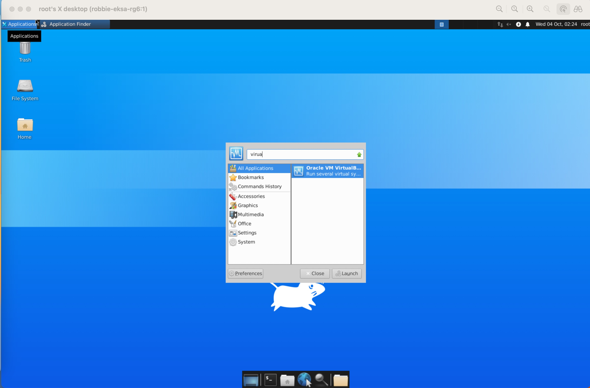
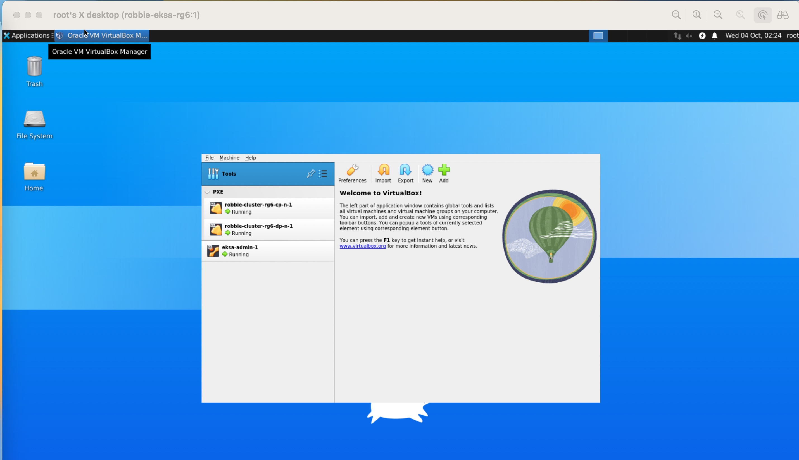
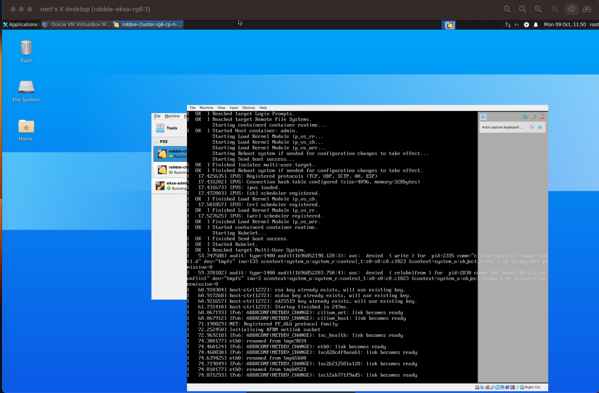

- [VM management](#vm-management)
- [Connecting to VMs over ssh](#connecting-to-vms-over-ssh)
- [Accessing VM Files](#accessing-vm-files)
- [Shell utilities to list and manage VM resources](#shell-utilities-to-list-and-manage-vm-resources)
    - [List all VM resources](#list-all-vm-resources)
    - [Launch VMs](#launch-vms)
    - [Delete VMs](#delete-vms)
    - [Resurrecting VMs on cloud instance reboot/stop-start](#resurrecting-vms-on-cloud-instance-rebootstop-start)
    - [Other utility scripts](#other-utility-scripts)
- [Using Virtualbox GUI to access cluster VMs and their consoles](#using-virtualbox-gui-to-access-vms-and-their-consoles)
- [Manually power VMs on/off and change boot order](#manually-power-vms-onoff-and-change-boot-order)

---

## VM management 

**BRAVE** emulates the entire bare metal infrastructure on a **single cloud** instance. It leverages [Virtualbox](https://www.virtualbox.org/) and [vagrant](https://www.vagrantup.com/) to `create VMs and a` [NAT Network](https://www.virtualbox.org/manual/ch06.html#network_nat_service). 

Virtualbox VMs are used to emulate bare metal servers, whereas VirtualBox's NAT Network is used to emulate the Layer2 Network these servers are connected to.  


### Connecting to VMs over ssh  

Virtualbox VMs are allocated static IPs just like bare metal servers would and ssh connectivity is automatically programmed so that all VMs can be logged into from the cloud instance. To ssh to VMs:

1. SSH to the cloud instance. An entry should already have been created in your ~/.ssh/config. Example entry:
```sh
Host brave-node
  Hostname 129.153.193.176
  StrictHostKeyChecking no
  IdentityFile /opt/rafay/keys/oci
  User ubuntu
```
To ssh simply use something like `ssh brave-node`

2. From the cloud instance, ssh to the VM by name. You can check the contents of `/home/ubuntu/.ssh/config` for name of VMs

```sh
cat /home/ubuntu/.ssh/config
ssh workers-1
```

### Accessing VM Files 

vagrant files and files to manage IP allocation are located in directory `/root/vm/vms/` on the cloud instance. [Shell utilities](#shell-utilities-to-list-and-manage-eksa-vm-resources) use files in this directory to manage VMs, network and IP allocation. 


### Shell utilities to list and manage VM resources

A number of utilities are provided to have a look under the hood and facilitate debugging and advanced use cases. To get access to these utilities, **connect to the cloud instance over ssh, switch to root user and cd to `/opt/rafay/vm-scripts/` directory**. The hostname of the instance should already have been programmed in ~/.ssh/config. For instance,

```sh
ssh brave-node
sudo su - 
cd /opt/rafay/vm-scripts/
```

Below is brief description of these utility scripts in `/opt/rafay/vm-scripts/` directory on the cloud instance relevant to VM management 

#### List all VM resources

- `list-vms.sh` : Shell script utility to list all VM virtual resources created on the cloud instance at Virtualbox layer. Below is a sample output of running this utility script. 

```sh
sudo su - 
bash /opt/rafay/vm-scripts/list-vms.sh 
```

Output::
```sh
-------------------------------

[+]  Listing Networks
NAT Networks:

Name:         vm-net
Enabled:      Yes
Network:      192.168.10.0/24
Gateway:      192.168.10.1
DHCP Server:  No
IPv6:         No
IPv6 Prefix:  fd17:625c:f037:2::/64
IPv6 Default: No
Port-forwarding (ipv4)
        ssh-to-storage-1:tcp:[]:3323:[192.168.10.23]:22
        ssh-to-workers-1:tcp:[]:3389:[192.168.10.89]:22
        ssh-to-workers-2:tcp:[]:3221:[192.168.10.221]:22
loopback mappings (ipv4)
        127.0.0.1=2

1 network found

-------------------------------

[+] Listing vms registered with vbox
"workers-1" {a3c5e4bb-c5df-42f6-a961-c74f482244a7}
"workers-2" {1b33d16d-8973-46dc-8d2e-59f18a3ea8f3}
"storage-1" {83339257-981f-4bfb-a938-4ff61d095e80}

-------------------------------

[+] Listing running vms
"workers-1" {a3c5e4bb-c5df-42f6-a961-c74f482244a7}
"workers-2" {1b33d16d-8973-46dc-8d2e-59f18a3ea8f3}
"storage-1" {83339257-981f-4bfb-a938-4ff61d095e80}

-------------------------------

[+] Listing vms vagrant folders
/root/vm/vms/workers-2/
/root/vm/vms/storage-1/
/root/vm/vms/workers-1/

-------------------------------

[+] Printing Global Allocation Table /root/vm/vms/global_allocation_table
VM_NAME,VM_MAC,VM_IP,VM_LOCAL_FORWARD_PORT
workers-1,08:00:27:AB:C3:71,192.168.10.89,3389
workers-2,08:00:27:7E:20:13,192.168.10.221,3221
storage-1,08:00:27:FD:77:85,192.168.10.23,3323

-------------------------------

```

**NOTE**: `VBoxManage` cli can also be used to list and manage VMs manually from the cloud instance. Refer to [VBoxManage cli docs](https://docs.oracle.com/en/virtualization/virtualbox/7.0/user/vboxmanage.html#vboxmanage-intro).

```sh
sudo su -
VBoxManage list runningvms
```

#### Launch VMs

- `launch-vms.sh`: Shell script utility to create VMs emulating bare metal servers. This  utility can be used to launch new VMs. `-n` switch is for specifying prefix name of the VM,  `-c` switch is number of VMs to launch, switches `-p` and `-m` are number of cpus in vcpu and memory in MB respectively. Switch `-o` is for OS family (current only "ubuntu" supported) and `-i` is for vagrant box name for the VM. 

Only `-n` is mandatory switch. Default values are: vm_num_cpus=2,  vm_mem_size=16384, vm_os_family=ubuntu and vm_image=bento/ubuntu-20.04

```sh
sudo su - 

bash /opt/rafay/vm-scripts/launch-vms.sh
Usage: ./launch-vms.sh -n <vm-name> [-c <#vms> -p <vm_num_cpus> -m <vm_mem_size> -o <vm_os_family> -i <vm_image>]
```

Examples:

```sh
Example 1: Add two Ubuntu 20.04 VMs with defaults size 2 vcpu and 16 GB Mem
# bash /opt/rafay/vm-scripts/launch-vms.sh -n brave -c 2 

This command will create two VMs `brave-1` and `brave-2` with defaults. 

```

#### Delete VMs
- `./delete-vm.sh`: Shell script utility to delete VMs.  `-v` switch is mandatory and provides name of the VM to delete

```sh
sudo su -
bash /opt/rafay/vm-scripts/delete-vm.sh
Usage: /opt/rafay/vm-scripts/delete-vm.sh  [-v <vm_name>]

```

Examples:

```sh
Example 1: Delete one vm named brave-1 
# bash /opt/rafay/vm-scripts/delete-vm.sh  -v brave-1
```

#### Resurrecting VMs on cloud instance reboot/stop-start

Whenever cloud instance is rebooted or stopped and started, all VMs are **automatically** powered on using utility script `resurrect-vms.sh` on the cloud instance. To manually do the same, SSH to the cloud instance and run below: 

```sh
sudo su -
bash /opt/rafay/vm-scripts/resurrect-vms.sh
```

#### Other utility scripts

Few other utility scripts are listed below (although these should rarely get used in normal circumstances) :

- `create-vm-network.sh`: Shell script utility to create the NAT Network for deploying VMs on: `vm-net`. You should not normally have to use this script by itself.

- `delete-vm-network.sh`: Shell script utility to delete the `vm-net` NAT Network for VMs. You should not normally have to use this script by itself.  


### Using Virtualbox GUI to access VMs and their consoles 

Tightvnc server is installed on the cloud instance during cluster creation. To connect to this vnc server and hence have access to virtualbox GUI, perform following steps on your system:

1. Port forward a local port (say 59000) to vnc port on cloud instance over ssh. The host entry for cloud instance should already be configured in ~/.ssh/config hence you can use the hostname in the ssh command for port forwarding as show below. Leave this ssh command running in a terminal on your system.

```sh
ssh -C -N  -L 59000:localhost:5901 cloud-instance-display-name
```
 

2. Now use a vnc client to connect to vncserver by connecting to local forwarded port on your system (On a Mac laptop simply use Finder->Go->Connect to Server) and use below vnc url and password 

```
vnc://127.0.0.1:59000   

eksapass 
```

Now you should be able to access GUI desktop of the cloud instance and find the virtualbox application in the application finder at the bottom of the screen (as shown below)




Once virtualbox GUI is open, you can acess details of all the virtualbox resources from there. 



To access consoles of VMs, just double click on the vm name. 




### Manually power VMs on/off and change boot order 

`VBoxManage` cli can  be used to list and manage VMs manually from the cloud instance. Refer to [VBoxManage cli docs](https://docs.oracle.com/en/virtualization/virtualbox/7.0/user/vboxmanage.html#vboxmanage-intro).


In advanced use cases and while debugging, it might be necessary to power VMs on and off and also change their boot order (whether to boot from disk or from network). Below are commands to use from the cloud instance


- Power off a VM named brave-dp-n-1

```sh
sudo su -
VBoxManage controlvm brave-dp-n-1 poweroff
```


- Power on a VM named brave-dp-n-1

```sh
sudo su -
VBoxManage startvm brave-dp-n-1 --type=headless
```


- Change boot order of a VM to boot from disk

```sh
sudo su -
VBoxManage controlvm brave-dp-n-1 poweroff
VBoxManage modifyvm brave-dp-n-1 --boot1=disk
```

- Change boot order of a VM to boot from network

```sh
sudo su -
VBoxManage controlvm brave-dp-n-1 poweroff
VBoxManage modifyvm brave-dp-n-1 --boot1=net
```

- List running VMs 

```sh
sudo su -
VBoxManage list runningvms
```

- List VMs 

```sh
sudo su -
VBoxManage list vms
```